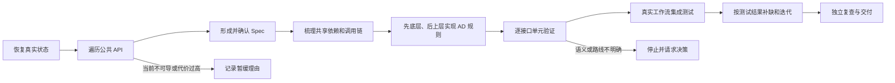

# 科学软件自动微分改造：Agent 执行流程

版本：v0.1  
依据：2026-09-01“自动微分功能落地协调会”智能纪要与文字记录（修订版 4）  
适用对象：负责为既有科学软件包增加自动微分能力的编码 Agent

## 1. 目标

在尽量不改动原软件包原有实现的前提下，为适合求导的公共 API 增加统一、可验证、能在真实工作流中使用的自动微分（AD）接口，包括 JVP（给定输入变化，计算输出变化）、VJP（给定输出方向，反向计算输入梯度）和普通梯度接口。

本流程解决的是“如何给既有科学软件补充 AD 导数规则”。它不要求把原软件重写成 JAX、PyTorch 或另一套计算框架，也不把少量示例中出现的接口误当成软件包的完整 AD 范围。

### 术语说明

| 术语 | 本文中的含义 |
|---|---|
| API | 供其他程序调用的公开函数、方法或命令行入口 |
| AD | 自动微分：由程序自动计算导数，不用手写完整求导过程 |
| JVP | 给定输入变化量，计算输出的一阶变化量 |
| VJP | 给定输出方向，反向计算各输入对它的影响 |
| primal | 直接运行原函数得到的值 |
| Spec | 实现规格说明：明确做什么、怎么调用、怎么验收 |
| oracle | 用来判断导数是否正确的独立参照结果 |
| 工作流 | 按真实使用方式串联多个接口的一组步骤 |
| ChainRules | 用来注册和调用 JVP/VJP 导数规则的库 |
| wrapper | 不改变原函数行为的轻量封装 |
| sidecar 包 | 与原软件分开安装、为原软件补充能力的配套包 |
| kernel | 承担核心数值计算的内部函数 |
| pullback | 已知输出变化后，反向计算输入变化的函数 |
| cotangent | 传给 VJP 的输出方向或权重 |
| adapter | 把真实工作流接到公开 AD 接口上的适配代码 |
| 有限差分 | 用多个相近输入的函数值近似导数的方法，只用于测试 |
| 复步长 | 用很小的复数扰动估计导数的方法，只用于测试 |
| 隐式微分 | 对由方程或求解过程定义的结果求导 |
| 伴随法 | 先反向求出输出对中间量的影响，再得到输入梯度的方法 |
| 拓扑 | 网格或对象之间的连接关系 |

## 2. 强制规则

Agent 在整个任务中必须遵守以下规则：

1. **保留原函数的计算语义。** 原函数计算出的值称为 primal（原函数值）。原函数是数值结果的唯一来源；AD 层只调用原函数并补充导数规则，不复制或改写整套原计算。
2. **使用统一 AD 接口。** 默认通过 ChainRules 的 `jvp`、`vjp`、`grad`、`value_and_grad` 以及导数规则注册接口暴露能力。若任务指定了其他统一接口，以任务指定版本为准，但仍须保留原函数和原参数结构。
3. **当前阶段不以 JAX 或 PyTorch 重写原包。** 不得为了使用某个框架的 AD 或优化器而重写底层函数。若原软件本来就使用该框架，可以复用其已有机制，但必须说明复用边界，不能用框架重写替代原实现。
4. **不直接修改上游原有代码。** 默认在独立规则包、配套包（sidecar）或轻量封装层（wrapper）中实现。若必须修改上游源码、改变原公共 API 或数据结构，先停止并请求用户决定。
5. **先公共 API，后工作流。** 先遍历目标软件包的公共 API，确定 AD 范围并形成实现规格说明（Spec）；工作流只用于后续集成验证和补缺，不能用预先挑选的少量工作流定义全部覆盖范围。
6. **先实现底层共享计算，再实现上层接口。** 先找出多个公共 AD 接口共同依赖的数值基础函数和已有导数代码或结果，再沿调用链逐层实现到公共 API。不得从每个顶层接口各写一套互不复用的导数代码。
7. **让优化器与 AD 框架彼此独立。** 优先使用不要求改写原包的通用优化器，例如 SciPy 优化器；简单场景可以实现最小优化循环。不得仅为了优化器引入 JAX 或 PyTorch 重写路线。
8. **正式运行时不悄悄使用有限差分。** 有限差分、复步长或高精度数值差分可以作为测试校验基准（oracle），但缺少正式规则时必须明确报错或标记未支持，不能暗中用有限差分冒充已实现的 AD。
9. **所有完成声明都要有可复查证据。** 至少给出文件位置、环境、命令、测试数量、通过/失败数量、误差阈值和仍未覆盖的接口。

## 3. 输入与最终产物

### 3.1 开始前必须确认的输入

- 目标软件包、上游仓库、固定版本或 commit（代码提交版本）。
- AD 规则应写入的仓库及允许修改的目录。
- 统一 AD 接口的仓库和固定版本。
- 上游公共文档、源码、测试、示例及可用的真实工作流来源。
- 支持的 Python、编译器、操作系统和硬件范围。
- 是否允许联网检索文献、安装依赖、使用开发机或产生付费计算。

缺少版本、目标仓库或允许修改的范围时，Agent 可以先做只读调查，但不能开始难以撤销或可能大范围返工的实现。

### 3.2 必须交付的产物

优先更新项目已有文档；只有没有合适文件时才新建：

- **Spec（实现规格说明）**：完整公共 API 清单、AD 取舍、接口约定、误差标准和明确不做的内容。
- **实现代码**：原函数的轻量封装、JVP/VJP 规则及必要的共享数值基础。
- **支持状态表**：逐项记录已实现、暂缓、不适合 AD 和未验证的能力。
- **测试与证据**：原函数值（primal）一致性、导数正确性、边界行为、真实工作流和安装后验证。
- **执行记录**：代码版本、环境、命令、结果、失败原因和下一步。

## 4. 总体执行顺序



不得跳过 Spec 直接实现，也不得先挑几个工作流后只实现这些工作流碰巧调用到的接口。

会议确定的四步简版如下；后面的阶段 0 至 7 是这四步的具体展开：

| 步骤 | Agent 要做什么 | 产物 |
|---|---|---|
| 1. 需求梳理 | 遍历公共 API，判断哪些适合 AD，写清输入、参与求导的参数、导数接口、边界和取舍 | Spec、完整覆盖表 |
| 2. 功能实现 | 依据 Spec，沿共享调用链先实现底层、再实现上层规则，并完成基础正确性检查 | 规则代码、单元测试 |
| 3. 测试安排 | 为已实现接口匹配真实工作流和集成测试，验证可用性、数值和性能 | 工作流用例、验证记录 |
| 4. 迭代优化 | 根据测试和工作流反馈修复实现、补齐缺口、更新 Spec 和支持状态 | 修订代码、证据和交付报告 |

## 5. 分阶段执行要求

### 阶段 0：恢复真实状态

1. 读取仓库内的 `AGENTS.md`、README、现有 Spec、支持状态、架构文档和测试说明。
2. 检查 Git 分支、代码提交版本、未提交修改、已有产物和正在运行的进程。用户已有修改不得覆盖。
3. 安装或复用规定环境，运行最小原始版本测试，记录通过数和失败数。
4. 定位统一 AD 接口的实际版本，阅读其 API 和一致性测试要求，不凭记忆编造接口。
5. 输出一段状态说明，区分：计划中的内容、已经写入的代码、测试报告声称通过的内容、已由当前 Agent 独立验证的内容。

本阶段完成条件：可以准确指出目标版本、写入范围、原始版本的基准测试结果和已有 AD 状态。

### 阶段 1：遍历公共 API，确定完整覆盖范围

这里的“完整覆盖范围”指本次必须逐项说明的全部公共 API 或公共能力族，而不是工作流中碰巧出现的几个函数。后续统计时，已纳入、暂缓、失败和未运行的数量都要与这个总数对上。

1. 从官方 API 文档、导出符号、公共类方法、命令行接口（CLI）、测试和示例交叉收集公共 API。
2. 按能力族合并机械重复项，但保留每个公共入口与能力族的映射。
3. 对每项判断：
   - `实现`：输入和输出语义明确，存在可行导数路线。
   - `暂缓`：有 AD 价值，但当前需要重大重构、缺少校验基准（oracle）或超出资源范围。
   - `不适合 AD`：主要执行文本解析、输入输出（I/O）、离散选择、随机搜索、拓扑变化或其他没有合理连续导数的操作。
4. 不得只根据函数名判断。必须查看源码调用链、测试和实际输入输出。
5. 对暂缓或不适合项写出具体原因及证据位置，不能只写“复杂”或“以后处理”。

每个候选接口至少记录以下字段：

| 字段 | 要求 |
|---|---|
| 原公共 API | 完整导入路径、方法或 CLI 名称 |
| 原函数语义（primal） | 输入、输出、单位、数组形状（shape）、数据类型（dtype）、状态依赖 |
| 参与求导的输入 | 调用方可以对哪些参数求导 |
| 求导期间固定的输入 | 哪些对象、网格、拓扑、索引或配置在求导期间保持不变 |
| 导数接口 | JVP、VJP、标量梯度或其他明确的导数结果 |
| 数学约定 | 实/复线性约定、归一化、边界及不可导点 |
| 可复用的已有计算 | 原函数、公式推导得到的导数、伴随法、线性化、因子分解或缓存 |
| 依赖链 | 支撑该公共接口的内部数值基础函数 |
| 导数校验基准（oracle） | 公式结果、上游导数、有限差分或独立实现 |
| 处理决定 | 实现、暂缓或不适合 AD，并附理由 |

本阶段完成条件：每个公共 API 或能力族都出现在表中，不存在因为“工作流没用到”而被悄悄遗漏的接口。

### 阶段 2：形成实现规格说明（Spec），并在实现前确认

Spec 是需求和接口约定，不是事后审计，也不是一份没有顺序的检查清单。Spec 至少包含：

1. 固定的上游版本和来源。
2. 阶段 1 的完整覆盖表。
3. 每个纳入接口的原函数签名、参与求导的输入、返回值和导数接口。
4. 原函数值（primal）是否要求完全相同；若只要求在容差内一致，给出绝对误差和相对误差。
5. JVP/VJP 的数组形状（shape）、数据类型（dtype）、单位、复数约定和错误行为。
6. 离散分支、奇点、截断点、排序变化和其他不可导点的处理方式。
7. 需要复用的原有代码和禁止重写的边界。
8. 每项验收测试、真实工作流来源和为什么具有代表性的说明。
9. 明确不做的内容、暂缓项和需要用户决定的事项。

Agent 应先提交 Spec 供复查，再按确认后的范围实现。若在实现中发现 Spec 错误，先更新 Spec 和理由，不能让代码与文档各说一套。

本阶段完成条件：另一位 Agent 只阅读 Spec 就能判断要实现什么、如何调用、如何测试以及什么不在范围内。

### 阶段 3：设计“先底层、后上层”的实现路线

1. 从纳入的公共 API 向下追踪调用链，画出公共入口到数值计算核心（kernel）的依赖关系。
2. 找出多个接口共同依赖的基础计算，例如线性求解、能量项、插值、特征组装或时间步进。
3. 为每个基础计算选择导数实现方式，优先级通常为：
   - 复用原软件已有的公式导数、伴随法或线性化；
   - 实现数学上明确的 JVP/VJP；
   - 使用隐式微分或自定义规则，但保留原函数作为 primal（原函数值的计算来源）；
   - 数值差分只用于验证，不进入正式规则。
4. 设计共享规则的复用关系，避免每个公共 API 重复实现相同数学。
5. 明确哪些中间量需要保存供反向计算（pullback）重用，哪些可以重新计算；记录内存和时间取舍。
6. 若公共 API 内部包含文本解析、网格生成、拓扑构造或离散决策，将其作为固定预处理；只对明确的连续数值计算部分求导。若不能在不改变公共语义的情况下分离，标记暂缓。

本阶段完成条件：实现顺序、共享基础、导数算法和状态边界均已明确。

### 阶段 4：实现统一 AD 导数规则

以 ChainRules 为例，导数规则层应保持原调用方式：

```python
import chainrules as ad


@ad.rules.jvp_for(original_function)
def original_function_jvp(tangents, *args, **kwargs):
    value = original_function(*args, **kwargs)
    tangent = apply_linearization(tangents, *args, **kwargs)
    return value, tangent
```

实现时逐项检查：

- 注册稳定的原函数；C 扩展（C extension）没有可检查的函数签名时，才增加轻量 Python 封装（wrapper）。
- JVP 只处理 `tangents`（输入变化量）中的参与求导参数；如果输入变化全为零，直接返回零输出变化。
- VJP 只计算 `wrt`（请求求导的参数）指定的输入，并返回与 `wrt` 完全一致的键（key）。
- 反向计算函数（pullback）可以安全地重复调用，保存的状态不会在第一次调用后被破坏。
- 输出结构、数据类型（dtype）、运行设备和单位与 Spec 一致。
- 不运行时改写原函数（monkey patch），不在适配层（adapter）中重算科学计算结果，不隐藏不支持的参数。
- 对未注册导数规则、不支持的参与求导输入和不可导点抛出明确错误。

本阶段完成条件：所有 Spec 纳入项都有可通过统一接口调用的正式导数实现，且共享底层规则先于上层组合规则完成。

### 阶段 5：逐接口验证

每个已实现接口至少验证：

1. **原函数值一致性（primal）**：AD 入口返回的 value 与直接调用原函数一致。
2. **导数正确性**：与公式推导得到的导数、原有实现中的导数或多步长数值校验基准（oracle）比较；报告绝对误差和相对误差。
3. **JVP/VJP 互相验证**：在适用的实数线性内积下检查两者是否一致。
4. **只对指定输入求导**：只请求一个参数时，不计算或返回其他参数的梯度。
5. **零方向与零输出方向**：验证零方向是否能直接返回，以及返回结构是否正确。
6. **边界行为**：奇点、分段点、截断点、离散切换、空输入和无效数组形状必须符合 Spec。
7. **可重复性**：固定随机种子、线程数和容差；记录硬件与依赖版本。
8. **安装后验证**：从构建产物安装到全新环境，通过公共接口运行，而不是依赖源码目录中的内部导入。

批量接口先选 2 至 3 个代表项跑通完整测试链，再扩大到全部纳入项。结束后必须核对：纳入数、通过数、失败数、暂缓数和未运行数之和等于完整覆盖范围的总数。

本阶段完成条件：所有已实现接口都有独立于实现代码的导数验证；缺少校验基准的接口不能标记为“正确”。

### 阶段 6：寻找并运行真实工作流

只有阶段 1 至 5 完成后，才用工作流做集成验证：

1. 从官方示例、上游测试、公开论文和研究代码中寻找真实、不是玩具的工作流。
2. 说明每个工作流为什么有代表性，包括问题规模、连续参数数量、迭代次数和所需导数接口。
3. 只通过已公开的 AD API 调用，不从内部模块绕过接口，也不在工作流适配层（adapter）中补写缺失导数。
4. 记录工作流覆盖的公共 AD 接口、未覆盖接口和新发现的能力缺口。
5. 比较原函数值（primal）、梯度、收敛行为、运行时间和峰值内存；不要只报告“可以运行”。
6. 对工作流暴露的缺口分类：实现缺陷、Spec 缺失、上游问题、环境问题或明确不做的内容。

工作流不能覆盖全部公共 API 时，保留逐接口测试；不得用一个成功的完整链路示例替代完整接口核对。

本阶段完成条件：至少一个有来源、有代表性、可复现的真实工作流通过公共 AD 接口运行，并有量化结果。

### 阶段 7：按反馈迭代并独立复查

1. 对失败建立最小可复现示例，先判断是实现错误、需求错误还是环境错误。
2. 修改共享底层规则后，重跑所有依赖它的公共接口测试和工作流测试。
3. 同步更新 Spec、支持状态、文档和证据；报告与代码不一致时以实际代码和重新运行结果为准。
4. 使用全新环境或独立 Agent 做一次只读复查，验证安装、公共 API、原函数值、导数、错误边界和工作流。
5. 给出最终计数和未解决问题，不使用“基本完成”掩盖缺项。

本阶段完成条件：交付结论可以由另一位 Agent 依据仓库文件和命令重新得到。

## 6. 必须暂停并请求决定的情况

出现以下任一情况时，Agent 应停止扩大实现，先报告证据和备选方案：

- 只有重写整个原软件为 JAX、PyTorch、Rust 或另一框架才能继续。
- 必须修改上游公共 API、保存文件格式或核心原有代码。
- 同一接口存在多种合理但结果明显不同的导数定义，例如固定网格/连接关系（拓扑），还是随输入重新构建拓扑。
- 需要新增大规模付费计算、GPU、云主机或外部人工资源。
- 缺少正确性校验基准，却需要对外宣称导数正确或与原软件等价。
- 需要对离散搜索、随机对接、排序、聚类、文本解析或拓扑变化给出未定义的“梯度”。
- 当前工作区的用户修改与目标改动冲突，无法安全绕开。

报告时必须给出：阻塞位置、最小可复现示例、已尝试方法、方案差异、成本和建议选择。

## 7. 首轮试点、资源与自动化条件

根据会议决定，流程自动化前先手工完成 3 个样例：

1. 优先选择逻辑简单、连续数值计算部分明确、没有复杂不可导中间层的软件包或接口族。
2. 三个样例分别完整走完“公共 API 清点 → Spec → 先底层后上层实现 → 单元验证 → 工作流验证”。
3. 对比三个样例中稳定重复的字段、步骤、错误类型和证据格式。
4. 只有在三次执行都不需要 Agent 猜测关键语义时，才把稳定部分写成自动化模板或标准流程。
5. 仍依赖领域判断的步骤保留人工复查，不为了自动化删除必要的技术决策。

会议约定的首轮资源安排：

- 试点负责人先挑选逻辑最简单、没有复杂中间层的软件包，手工走完三个样例并记录规则边界。
- 侯鹏程负责准备约 4 至 5 台阿里云 ECS/ESW 开发机（云上的远程计算机），单台约 16 核、48G 内存，并通过公钥登录。Agent 不应在文档或日志中记录私钥、密码或访问令牌。
- 开始使用开发机前，先确认主机地址、用户名、Python/编译器版本、磁盘和依赖安装方式；这些信息写入执行记录。
- 资源尚未就绪时，可以继续做只读调查、公共 API 清点、Spec 和本地小样例；不要把未完成的资源配置报告成已验证结果。
- 首轮试点后安排一次同步，集中讨论三个样例暴露的问题和流程修改；同步结论必须回写 Spec 或本流程文档。

## 8. Agent 每次状态更新模板

```text
当前结果
- 已完成对象和数量：
- 当前版本/commit（代码提交版本）：

复查证据
- 修改文件：
- 运行环境：
- 命令：
- 测试：总数 / 通过 / 失败 / 跳过 / 未运行
- 数值误差或性能结果：

仍存在的问题
- 未实现或暂缓接口：
- 失败原因：
- 对结论的影响：

下一步
- Agent 可以直接继续的动作：
- 必须由用户决定的事项：
```

## 9. 最终完成检查

- [ ] 已固定并记录原软件与统一 AD 接口版本。
- [ ] 已遍历全部公共 API 或公共能力族，并逐项记录处理决定。
- [ ] Spec 在实现前形成，代码、文档和支持状态与其一致。
- [ ] 原函数仍是原函数值（primal）的计算来源，没有整包 JAX/PyTorch 重写。
- [ ] AD 规则按共享依赖先底层后上层实现，并通过统一接口调用。
- [ ] 每个已实现接口都有原函数值、导数、零方向、边界和错误测试。
- [ ] 数值差分只作为校验基准，没有成为未声明的生产备用路径（fallback）。
- [ ] 至少一个真实工作流通过公共接口验证，并报告量化结果。
- [ ] 构建后的安装包在全新环境中通过验证。
- [ ] 实现、暂缓、失败和未运行数量可以与完整覆盖范围的总数对上。
- [ ] 最终报告包含文件、命令、环境、数字、风险和下一步。

